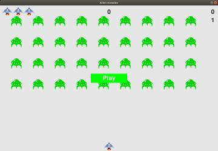

# Programming Practice Everyday

## 1. 编程语言

### 1.1 Python

#### 1.1.1 基础知识学习

python基础操作练习

|项目|项目|项目|项目|
| :--: |:--: |:--: |:--: |
|[001-变量和简单的数据类型](https://github.com/huuuuusy/Programming-Practice-Everyday/tree/master/Python-Learning/001-%E5%8F%98%E9%87%8F%E5%92%8C%E7%AE%80%E5%8D%95%E7%9A%84%E6%95%B0%E6%8D%AE%E7%B1%BB%E5%9E%8B)|[002-列表操作](https://github.com/huuuuusy/Programming-Practice-Everyday/tree/master/Python-Learning/002-%E5%88%97%E8%A1%A8%E6%93%8D%E4%BD%9C)|[003-循环](https://github.com/huuuuusy/Programming-Practice-Everyday/tree/master/Python-Learning/003-%E5%BE%AA%E7%8E%AF)|[004-字典](https://github.com/huuuuusy/Programming-Practice-Everyday/tree/master/Python-Learning/004-%E5%AD%97%E5%85%B8)|
|[005-函数](https://github.com/huuuuusy/Programming-Practice-Everyday/tree/master/Python-Learning/005-%E5%87%BD%E6%95%B0)|[006-类](https://github.com/huuuuusy/Programming-Practice-Everyday/tree/master/Python-Learning/006-%E7%B1%BB)|[007-文件](https://github.com/huuuuusy/Programming-Practice-Everyday/tree/master/Python-Learning/007-%E6%96%87%E4%BB%B6)|

#### 1.1.2 小型项目

|项目|介绍|日期|
| :--: |:--: |:--:|
|[001-Alien-Invasion-Game](https://github.com/huuuuusy/Programming-Practice-Everyday/tree/master/Python-Learning/001-Alien-Invasion-Game)|利用Pygame开发一款有关于外星人入侵的2D射击类游戏| 190704:V1完成|

### 1.2 C++

## 2. LeetCode

|项目|项目|项目|项目|项目|
| :--: |:--: |:--: |:--: |:--: |
|[0001-两数之和](https://github.com/huuuuusy/Programming-Practice-Everyday/tree/master/LeetCode/0001-%E4%B8%A4%E6%95%B0%E4%B9%8B%E5%92%8C)|
|[0011-盛水最多的容器](https://github.com/huuuuusy/Programming-Practice-Everyday/tree/master/LeetCode/0011-%E7%9B%9B%E6%B0%B4%E6%9C%80%E5%A4%9A%E7%9A%84%E5%AE%B9%E5%99%A8)|[0014-最长公共前缀](https://github.com/huuuuusy/Programming-Practice-Everyday/tree/master/LeetCode/0014-%E6%9C%80%E9%95%BF%E5%85%AC%E5%85%B1%E5%89%8D%E7%BC%80)|[0015-三数之和*](https://github.com/huuuuusy/Programming-Practice-Everyday/tree/master/LeetCode/0015-%E4%B8%89%E6%95%B0%E4%B9%8B%E5%92%8C*)|
|[0026-删除排序数组中的重复项](https://github.com/huuuuusy/Programming-Practice-Everyday/tree/master/LeetCode/0026-%E5%88%A0%E9%99%A4%E6%8E%92%E5%BA%8F%E6%95%B0%E7%BB%84%E4%B8%AD%E7%9A%84%E9%87%8D%E5%A4%8D%E9%A1%B9)|[0027-移除元素](https://github.com/huuuuusy/Programming-Practice-Everyday/tree/master/LeetCode/0027-%E7%A7%BB%E9%99%A4%E5%85%83%E7%B4%A0)|[0028-实现strStr](https://github.com/huuuuusy/Programming-Practice-Everyday/tree/master/LeetCode/0028-%E5%AE%9E%E7%8E%B0strStr)|
|[0035-搜索插入位置](https://github.com/huuuuusy/Programming-Practice-Everyday/tree/master/LeetCode/0035-%E6%90%9C%E7%B4%A2%E6%8F%92%E5%85%A5%E4%BD%8D%E7%BD%AE)|
|[0053-最大子序和*](https://github.com/huuuuusy/Programming-Practice-Everyday/tree/master/LeetCode/0053-%E6%9C%80%E5%A4%A7%E5%AD%90%E5%BA%8F%E5%92%8C*)|[0054-螺旋矩阵](https://github.com/huuuuusy/Programming-Practice-Everyday/tree/master/LeetCode/0054-%E8%9E%BA%E6%97%8B%E7%9F%A9%E9%98%B5)|
|[0066-加一](https://github.com/huuuuusy/Programming-Practice-Everyday/tree/master/LeetCode/0066-%E5%8A%A0%E4%B8%80)|[0067-二进制求和](https://github.com/huuuuusy/Programming-Practice-Everyday/tree/master/LeetCode/0067-%E4%BA%8C%E8%BF%9B%E5%88%B6%E6%B1%82%E5%92%8C)|
|[0088-合并两个有序数组](https://github.com/huuuuusy/Programming-Practice-Everyday/tree/master/LeetCode/0088-%E5%90%88%E5%B9%B6%E4%B8%A4%E4%B8%AA%E6%9C%89%E5%BA%8F%E6%95%B0%E7%BB%84)|
|[0118-杨辉三角](https://github.com/huuuuusy/Programming-Practice-Everyday/tree/master/LeetCode/0118-%E6%9D%A8%E8%BE%89%E4%B8%89%E8%A7%92)|[0119-杨辉三角2](https://github.com/huuuuusy/Programming-Practice-Everyday/tree/master/LeetCode/0119-%E6%9D%A8%E8%BE%89%E4%B8%89%E8%A7%922)|
|[0167-两数之和 II - 输入有序数组](https://github.com/huuuuusy/Programming-Practice-Everyday/tree/master/LeetCode/0167-%E4%B8%A4%E6%95%B0%E4%B9%8B%E5%92%8C%20II%20-%20%E8%BE%93%E5%85%A5%E6%9C%89%E5%BA%8F%E6%95%B0%E7%BB%84)|
|[0209-长度最小的子数组](https://github.com/huuuuusy/Programming-Practice-Everyday/tree/master/LeetCode/0209-%E9%95%BF%E5%BA%A6%E6%9C%80%E5%B0%8F%E7%9A%84%E5%AD%90%E6%95%B0%E7%BB%84)|
|[0344-反转字符串](https://github.com/huuuuusy/Programming-Practice-Everyday/tree/master/LeetCode/0344-%E5%8F%8D%E8%BD%AC%E5%AD%97%E7%AC%A6%E4%B8%B2)|
|[0485-最大连续1的个数](https://github.com/huuuuusy/Programming-Practice-Everyday/tree/master/LeetCode/0485-%E6%9C%80%E5%A4%A7%E8%BF%9E%E7%BB%AD1%E7%9A%84%E4%B8%AA%E6%95%B0)|
|[0487-最大连续1的个数 II](https://github.com/huuuuusy/Programming-Practice-Everyday/tree/master/LeetCode/0487-%E6%9C%80%E5%A4%A7%E8%BF%9E%E7%BB%AD1%E7%9A%84%E4%B8%AA%E6%95%B0%20II*)|
|[0498-对角线遍历*](https://github.com/huuuuusy/Programming-Practice-Everyday/tree/master/LeetCode/0498-%E5%AF%B9%E8%A7%92%E7%BA%BF%E9%81%8D%E5%8E%86*)|
|[0561-数组拆分1](https://github.com/huuuuusy/Programming-Practice-Everyday/tree/master/LeetCode/0561-%E6%95%B0%E7%BB%84%E6%8B%86%E5%88%861)|
|[0709-转换成小写字母](https://github.com/huuuuusy/Programming-Practice-Everyday/tree/master/LeetCode/0709-%E8%BD%AC%E6%8D%A2%E6%88%90%E5%B0%8F%E5%86%99%E5%AD%97%E6%AF%8D)|
|[0724-寻找数组的中心索引*](https://github.com/huuuuusy/Programming-Practice-Everyday/tree/master/LeetCode/0724-%E5%AF%BB%E6%89%BE%E6%95%B0%E7%BB%84%E7%9A%84%E4%B8%AD%E5%BF%83%E7%B4%A2%E5%BC%95*)|
|[0747-至少是其他数字两倍的最大数](https://github.com/huuuuusy/Programming-Practice-Everyday/tree/master/LeetCode/0747-%E8%87%B3%E5%B0%91%E6%98%AF%E5%85%B6%E4%BB%96%E6%95%B0%E5%AD%97%E4%B8%A4%E5%80%8D%E7%9A%84%E6%9C%80%E5%A4%A7%E6%95%B0#0747-%E8%87%B3%E5%B0%91%E6%98%AF%E5%85%B6%E4%BB%96%E6%95%B0%E5%AD%97%E4%B8%A4%E5%80%8D%E7%9A%84%E6%9C%80%E5%A4%A7%E6%95%B0)|
|[1004-最大连续1的个数 III](https://github.com/huuuuusy/Programming-Practice-Everyday/tree/master/LeetCode/1004-%E6%9C%80%E5%A4%A7%E8%BF%9E%E7%BB%AD1%E7%9A%84%E4%B8%AA%E6%95%B0%20III*)|

**星号: 本题参考了其他人的解法**